```{r}
#| label: setup
#| include: false
source("R/00_prep.R")
library(ggplot2)
ok_font <- tryCatch({
  library(showtext); sysfonts::font_add_google("Ubuntu", "ubuntu")
  showtext_auto(); showtext_opts(dpi = 150); TRUE
}, error = function(e) FALSE)
FF <- if (ok_font) "ubuntu" else "sans"
source("R/_edad_plot.R")
source("R/02_galeria.R")
```

::: {style="max-width:720px;margin:0 auto;padding:3rem 1.5rem;font-family:Ubuntu,sans-serif;"}
Argentina llega al Mundial 2026 como **campeón del mundo vigente**. Detrás de la camiseta hay 26 jugadores: algunos que recién asoman, otros que ya lo ganaron todo. Recorré el plantel a través de los datos.

*Datos: Transfermarkt · Lista oficial de 26 anunciada por Scaloni el 28/05/2026.*
:::


:::: cr-section
## El plantel en la cancha

Los **26 convocados** de Scaloni, organizados por línea. Un equipo que defiende la corona. @cr-cancha-arq

**Arqueros (3):** [**Emiliano Martínez**]{.cr-hl} · Gerónimo Rulli · Juan Musso

El Dibu es indiscutido: 59 partidos con la Selección y una Copa del Mundo en el arco. @cr-cancha-arq

**Defensores (8):** [**Otamendi**]{.cr-hl} (130 partidos) · Tagliafico · Molina · Montiel · Cristian Romero · Lisandro Martínez · Balerdi · Medina @cr-cancha-def

**Mediocampistas (8):** [**De Paul**]{.cr-hl} (85 partidos) · Paredes · Lo Celso · Mac Allister · Enzo Fernández · Palacios · Nico Paz · Barco @cr-cancha-mid

**Delanteros (7):** [**Messi**]{.cr-hl} (198 partidos) · Lautaro · Julián Álvarez · Nico González · Simeone · Almada · J.M. López @cr-cancha-fwd

El equipo dentro del equipo: [**Scaloni**]{.cr-hl} y los suyos. Tres ídolos reconvertidos en técnicos (Aimar, Samuel y Ayala) más Tocalli en los arqueros. El mismo cuerpo que armó la era campeona, intacto. @cr-cancha-ct

::: {#cr-cancha-arq}
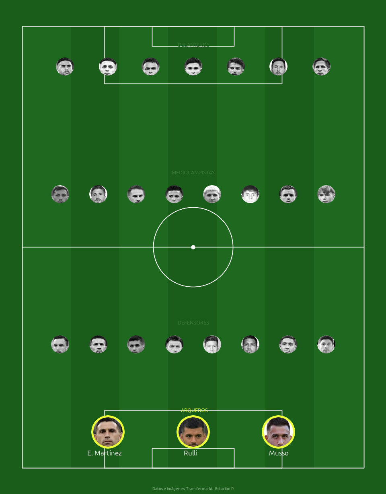{width="88%" fig-align="center"}
:::

::: {#cr-cancha-def}
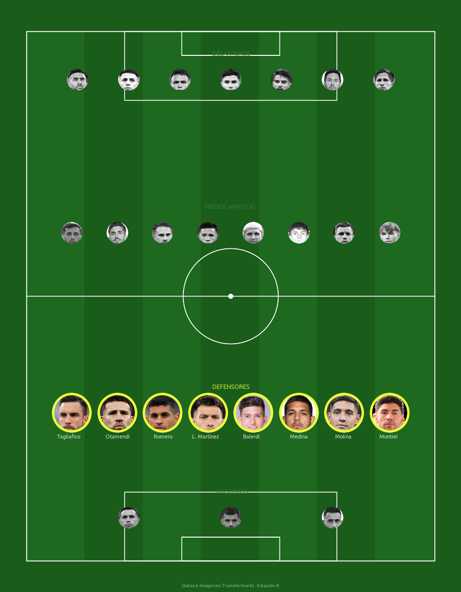{width="88%" fig-align="center"}
:::

::: {#cr-cancha-mid}
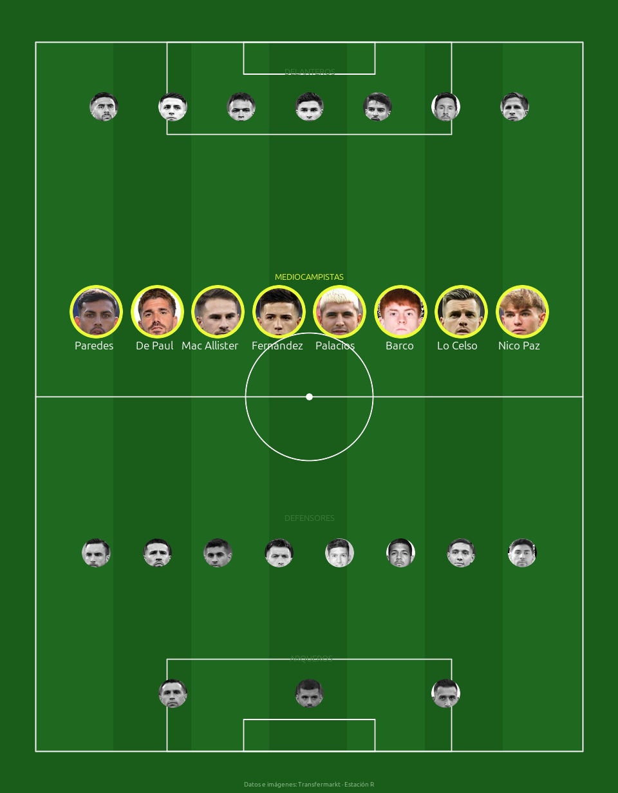{width="88%" fig-align="center"}
:::

::: {#cr-cancha-fwd}
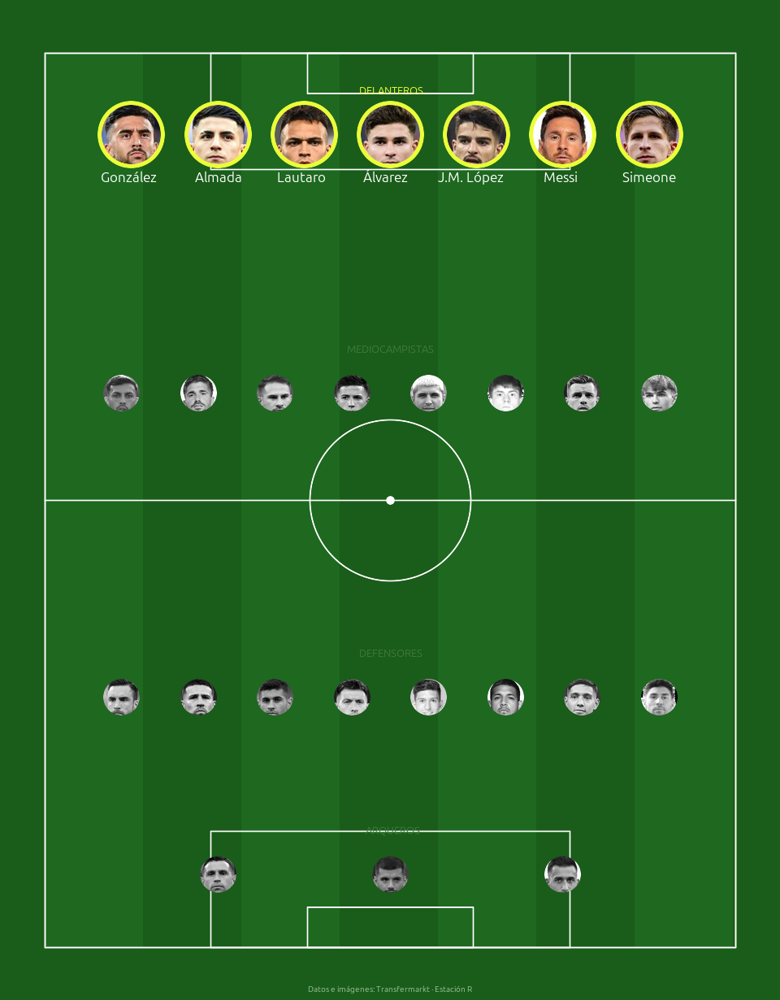{width="88%" fig-align="center"}
:::

::: {#cr-cancha-ct}
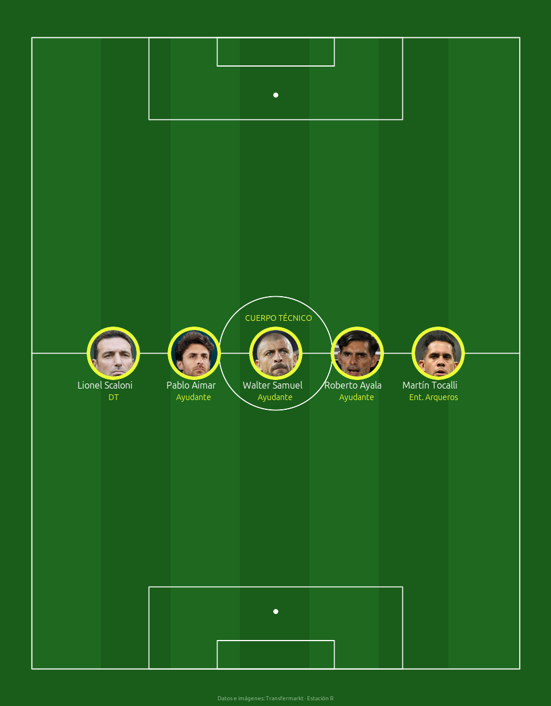{width="88%" fig-align="center"}
:::
::::

:::: cr-section
¿Cuántos de estos 26 ya saben lo que es salir campeón del mundo? Nada menos que [**17**]{.cr-hl} **(65%)**: A pesar de la renovación, la base de Qatar 2022 sigue de pie. @cr-camp

En color, los que levantaron la copa; en gris, los que todavía no.

**Dato:** Nico González y Lo Celso habían sido citados en 2022, pero se lesionaron antes del torneo y no llegaron a entrar. @cr-camp

::: {#cr-camp}
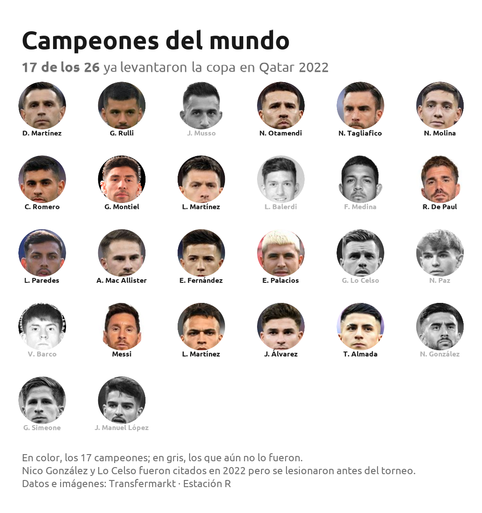{width="80%" fig-align="center"}
:::
::::

:::: cr-section
## Origen del plantel

Solo **7 provincias** del país aportan jugadores al plantel. El mapa lo dice todo: la producción futbolera argentina no está repartida de forma pareja por el territorio. @cr-mapa-base

De los 26 convocados, [**14**]{.cr-hl} nacieron en la **provincia de Buenos Aires**: más de la mitad del plantel salió del mismo territorio. @cr-mapa-ba

*Emi Martínez · Rulli · Musso · Medina · Montiel · Otamendi · Tagliafico · Enzo Fernández · Paredes · De Paul · Barco · Lautaro Martínez · Nico González · Almada* @cr-mapa-ba

· **Córdoba y Santa Fe** aportan 3 jugadores cada una. @cr-mapa-cbsf

· **Córdoba:** Cristian Romero · Julián Álvarez · Nahuel Molina @cr-mapa-cbsf

· **Santa Fe:** Lo Celso · José Manuel López · Messi @cr-mapa-cbsf

El resto se reparte entre **La Pampa, Entre Ríos, San Luis y Tucumán**: 1 jugador cada una. @cr-mapa-resto

· **La Pampa:** Mac Allister 
· **Entre Ríos:** Lisandro Martínez 
· **San Luis:** Balerdi 
· **Tucumán:** Palacios @cr-mapa-resto

**Dato:** Ninguno de los convocados nació en la **Ciudad Autónoma de Buenos Aires**, capital del país. @cr-mapa-ba

Y hay dos casos de "exportación al revés": **Nico Paz** nació en Tenerife (España) y **Giuliano Simeone** en Roma (Italia). @cr-mapa-full

::: {#cr-mapa-base}
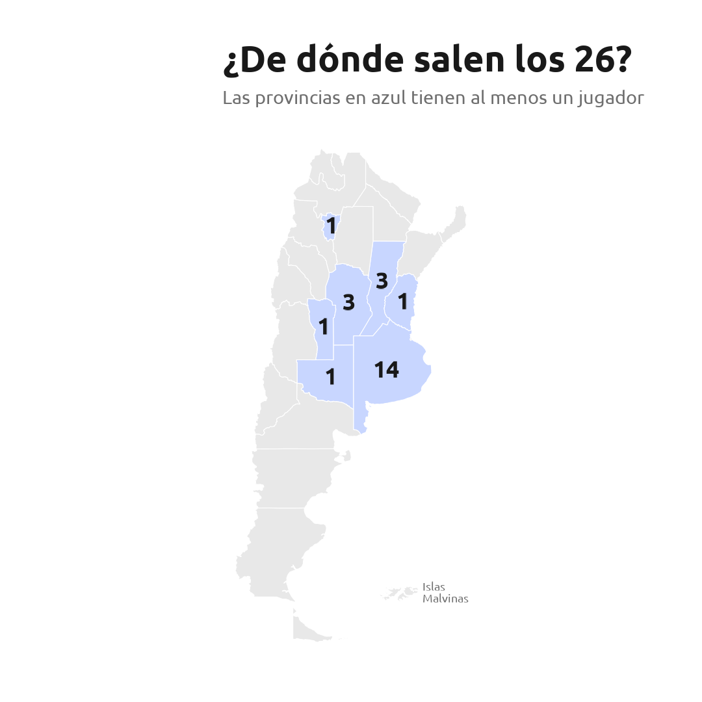{width="88%" fig-align="center"}
:::

::: {#cr-mapa-ba}
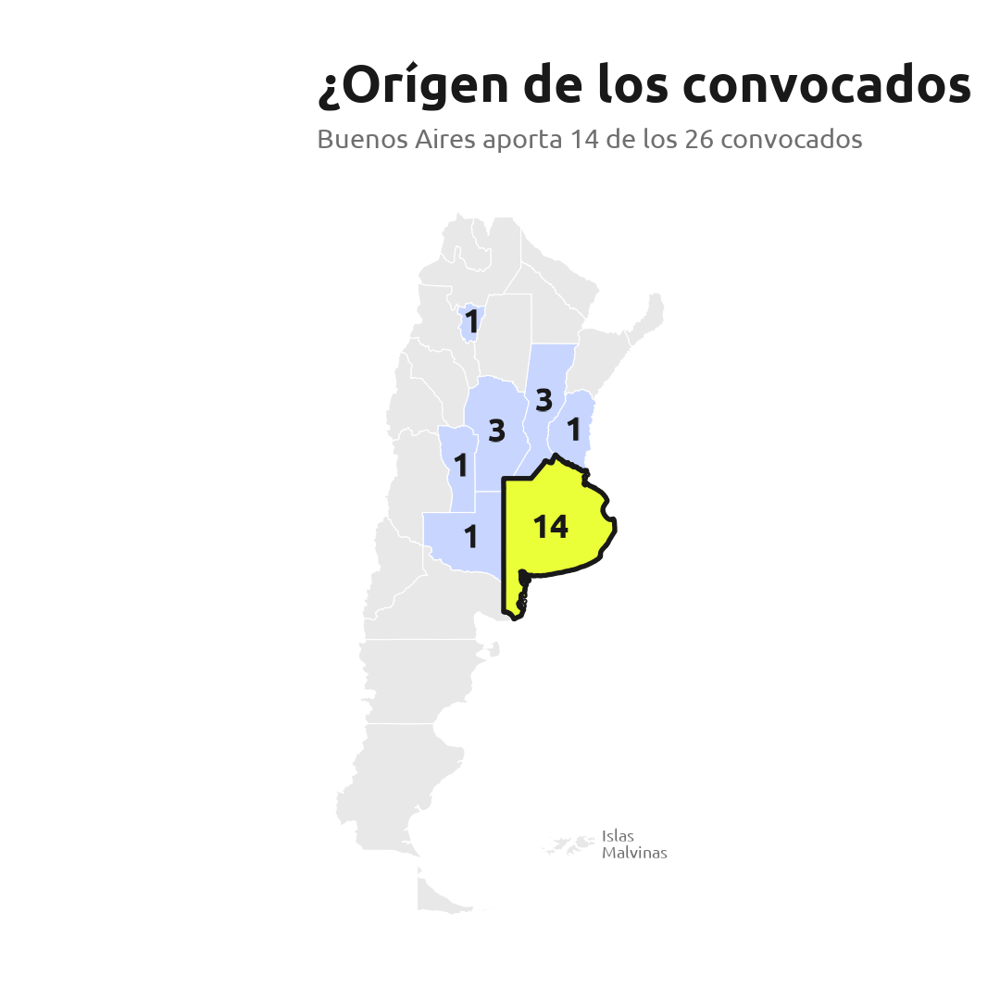{width="88%" fig-align="center"}
:::

::: {#cr-mapa-cbsf}
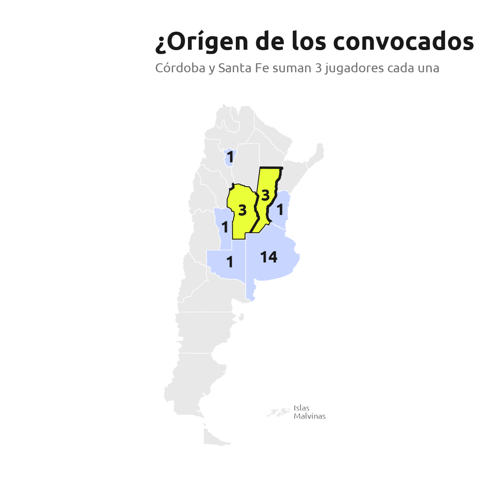{width="88%" fig-align="center"}
:::

::: {#cr-mapa-resto}
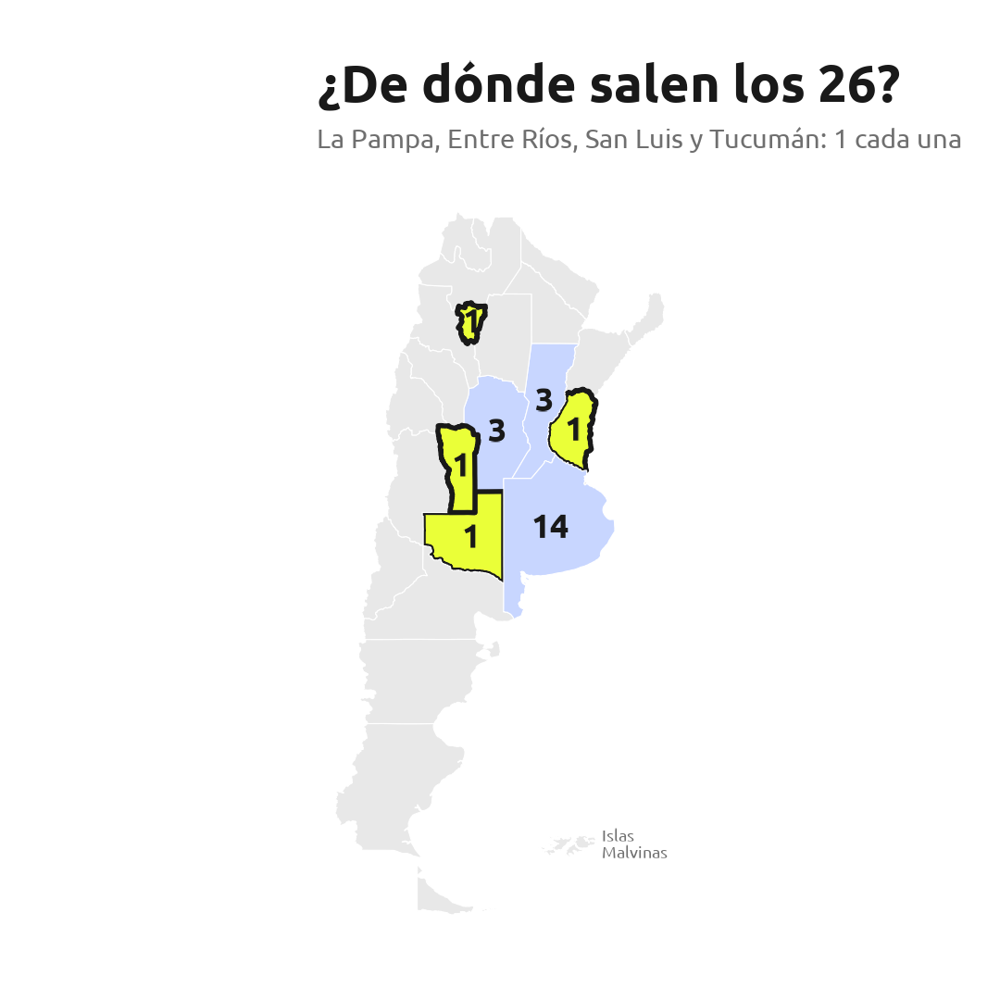{width="88%" fig-align="center"}
:::

::: {#cr-mapa-full}
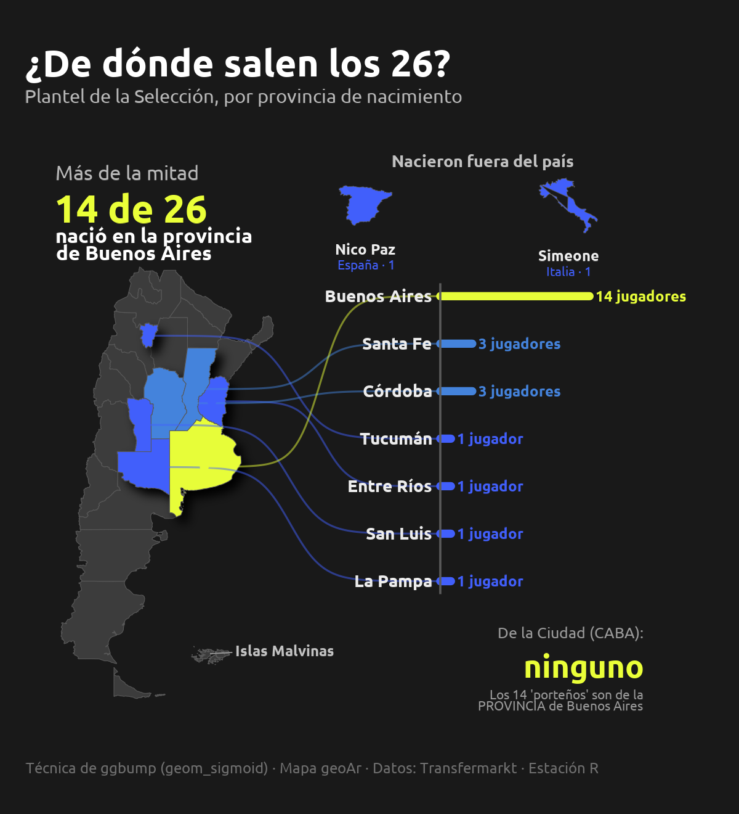{width="92%" fig-align="center"}
:::
::::

:::: cr-section
La edad promedio del plantel es de [**`r dato_edad$prom` años**]{.cr-hl}. @cr-edad

En los extremos conviven dos generaciones: **Barco y Nico Paz**, los más jóvenes con apenas `r dato_edad$joven$age` años, y **Otamendi y Messi**, los veteranos con `r dato_edad$veterano$age`. Diecisiete años de diferencia separan los extremos. **Pasá el mouse** sobre cualquier punto para ver de quién se trata. @cr-edad

::: {#cr-edad}
```{r}
#| label: edad-plot
#| fig-align: center
#| out-width: "100%"
build_edad_girafe(plantel, prom = dato_edad$prom, FF = FF, scale = 1.3,
                  width_svg = 10, height_svg = 4.5)
```
:::
::::

:::: cr-section
## Experiencia mundialista

Más allá de la edad, la experiencia tiene otra dimensión: los **partidos con la Selección** y los **Mundiales jugados**. Si los cruzamos, el plantel se parte en dos mundos. @cr-scatter

**Otamendi,** el veterano, es el único con tres copas encima (2014, 2018 y 2022). En la base, **7 jugadores** todavía no disputaron ninguno. @cr-scatter

**Messi**, un universo aparte: [**198 partidos y 5 Mundiales**]{.cr-hl} en sus hombros. @cr-scatter

::: {#cr-scatter}
```{r}
#| label: scatter-mundiales-interactivo
#| out-width: "100%"
source("R/09_scatter_mundiales.R")
build_scatter_girafe()
```
:::
::::

:::: cr-section
Es una Selección de exportación: [**24 de los 26**]{.cr-hl} juegan fuera del país. @cr-ext

Solo dos militan en la liga local: **Paredes** (Boca) y **Montiel** (River). @cr-ext

::: {#cr-ext}
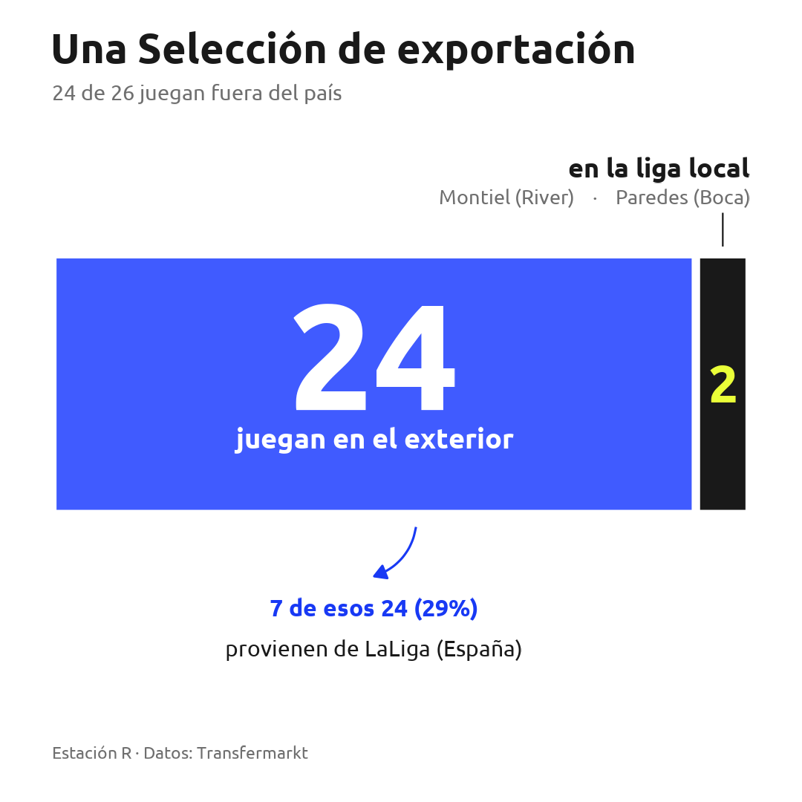{width="80%" fig-align="center"}
:::
::::

:::: cr-section
## El valor del plantel

El plantel suma **€`r round(sum(plantel$mv_eur))` millones** de valor de mercado. @cr-packing

**Enzo Fernández** y **Julián Álvarez** encabezan con €90 millones cada uno; **Lautaro Martínez** los pisa con €85. @cr-packing

Cada burbuja es un jugador y su tamaño es proporcional al valor de mercado; los colores agrupan por posición. **Pasá el mouse** (o tocá, en celular) sobre cualquiera para ver su posición, club, valor y partidos con la Selección. @cr-packing

::: {#cr-packing}
```{r}
#| label: valor-packing-interactivo
#| out-width: "100%"
source("R/08_valor_packing.R")
build_packing_girafe()
```
:::
::::

:::: cr-section
## Goleador

El plantel hizo [**`r total_goles_nt` goles**]{.cr-hl} con la Selección mayor. @cr-goles

Pero la repartija es de otro planeta: **Messi** metió 116 él solo, más de la mitad de todos. Así queda el ranking, con el capitán rompiendo la escala. @cr-goles

::: {#cr-goles}
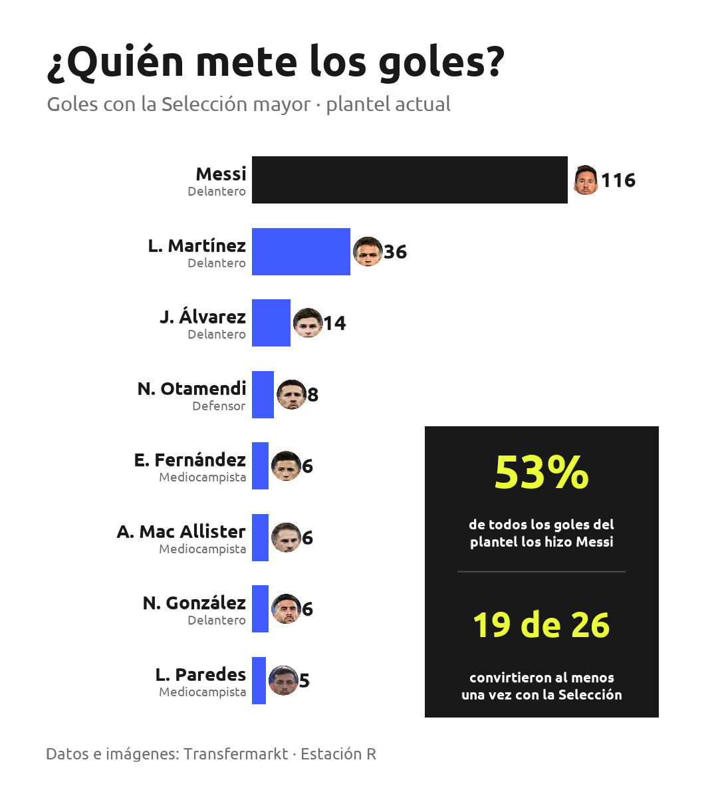{fig-align="center"}
:::
::::

::: {style="max-width:880px;margin:0 auto;padding:1rem 1.5rem 0.5rem;font-family:Ubuntu,sans-serif;font-size:0.85rem;color:#6F6F6F;text-align:center;"}
*Hecho con R (ggplot2, sf, gt, geoAr) + Quarto closeread · Estación R*
:::

:::: {style="max-width:880px;margin:0 auto;padding:3rem 1.5rem 4rem;font-family:Ubuntu,sans-serif;"}
## Anexo: El plantel completo

Los **26 convocados** por Scaloni, ordenados por partidos con la Selección.

```{r}
#| label: plantel-completo
build_galeria_gt()
```
::::