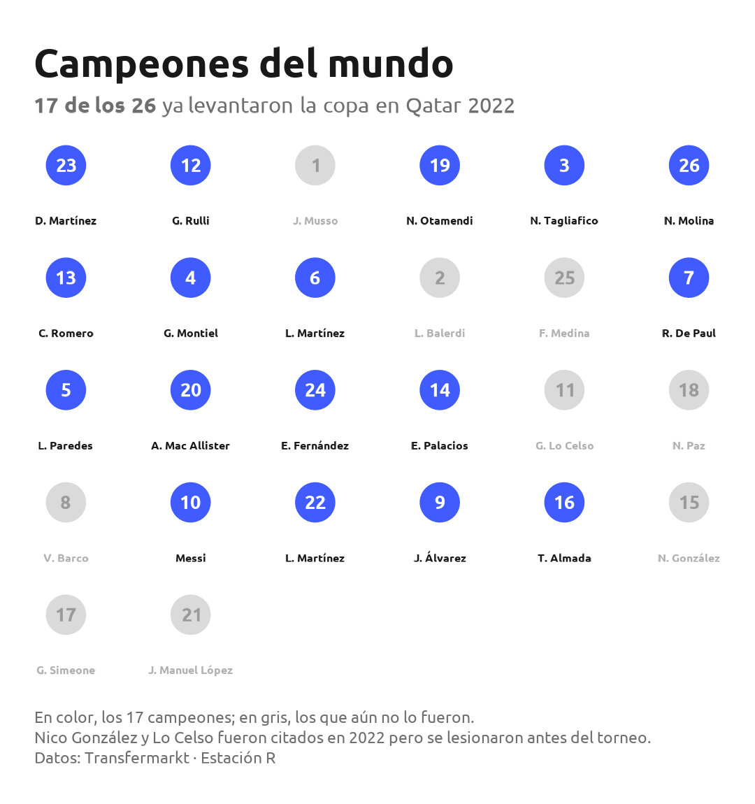
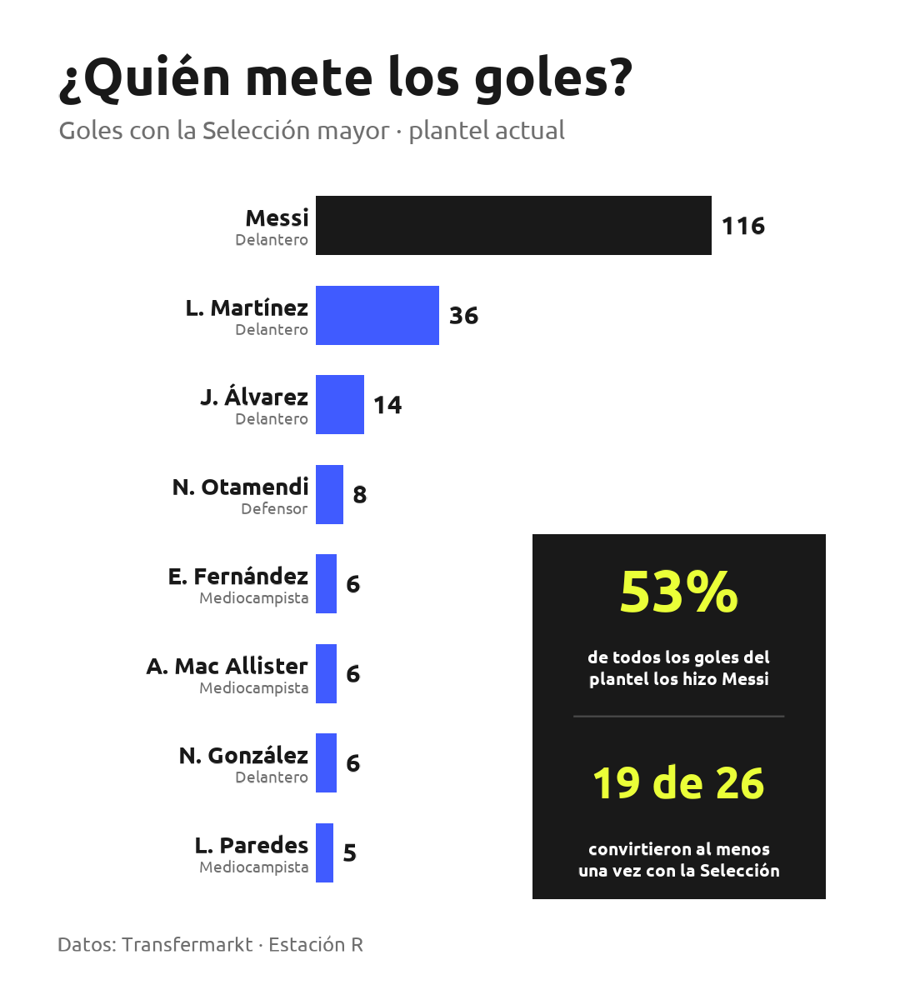

```{r}
#| label: setup
#| include: false
source("R/00_prep.R")
library(ggplot2)
ok_font <- tryCatch({
  library(showtext); sysfonts::font_add_google("Ubuntu", "ubuntu")
  showtext_auto(); showtext_opts(dpi = 150); TRUE
}, error = function(e) FALSE)
FF <- if (ok_font) "ubuntu" else "sans"
source("R/_edad_plot.R")
source("R/02_galeria.R")
```

::: {style="max-width:720px;margin:0 auto;padding:3rem 1.5rem;font-family:Ubuntu,sans-serif;"}

Argentina llega al Mundial 2026 como **campeón del mundo vigente**. Detrás de
la camiseta hay 26 jugadores: algunos pibes que recién asoman, otros que ya lo
ganaron todo. Empecemos por conocerlos uno por uno, y después metámonos en los
datos.

*Datos: Transfermarkt · Lista oficial de 26 anunciada por Scaloni el 28/05/2026.*

:::

::: {style="max-width:820px;margin:0 auto;padding:1rem 1.5rem 0;font-family:Ubuntu,sans-serif;"}

## El plantel, línea por línea

Estos son **los 26 convocados** por Scaloni. Cada jugador, su club y **el país
donde juega** hoy. Bajá y andá conociendo las cuatro líneas de la Selección,
**de los arqueros a los delanteros**.

::: {.convocados-nota}
🇦🇷 **Convocatoria oficial · Mundial 2026** — 3 arqueros, 8 defensores,
8 mediocampistas y 7 delanteros.
:::

::: {.linea-reveal}
```{r}
#| label: galeria-arqueros
build_galeria_linea("Arquero")
```
:::

::: {.linea-reveal}
```{r}
#| label: galeria-defensores
build_galeria_linea("Defensor")
```
:::

::: {.linea-reveal}
```{r}
#| label: galeria-mediocampistas
build_galeria_linea("Mediocampista")
```
:::

::: {.linea-reveal}
```{r}
#| label: galeria-delanteros
build_galeria_linea("Delantero")
```
:::

:::

:::: {.cr-section}

¿Cuántos de estos 26 ya saben lo que es salir campeón del mundo? Nada menos que
[**17**]{.cr-hl}: la base de Qatar 2022 sigue de pie. @cr-camp

En color, los que levantaron la copa; en gris, los que todavía no. Nico
González y Lo Celso habían sido citados en 2022, pero se lesionaron antes del
torneo y no cuentan. @cr-camp

::: {#cr-camp}
{width="80%" fig-align="center"}
:::

::::

:::: {.cr-section}

De los 26 jugadores, [**14**]{.cr-hl} nacieron en la **provincia de Buenos
Aires**: más de la mitad del plantel salió del mismo territorio. @cr-mapa

Córdoba y Santa Fe aportan 3 cada una; el resto se reparte entre La Pampa,
Entre Ríos, San Luis y Tucumán. @cr-mapa

Pero acá hay un **dato que sorprende**: de la **Ciudad de Buenos Aires**, la
capital del país, no nació [**ninguno**]{.cr-hl}. @cr-mapa

Cuidado con la trampa: provincia y Ciudad no son lo mismo. Esos 14 "porteños"
en realidad son **bonaerenses** del conurbano y del interior (San Martín,
Avellaneda, La Matanza, Bahía Blanca…). De CABA, **cero**. @cr-mapa

Y hay dos casos de "exportación al revés": **Nico Paz** nació en Tenerife
(España) y **Giuliano Simeone** en Roma (Italia). @cr-mapa

::: {#cr-mapa}
{width="92%" fig-align="center"}
:::

::::

:::: {.cr-section}

La edad promedio del plantel es de [**`r dato_edad$prom` años**]{.cr-hl}. @cr-edad

En los extremos conviven dos generaciones: **`r dato_edad$joven$name`**, de apenas
**`r dato_edad$joven$age`**, y **`r dato_edad$veterano$name`**, de **`r dato_edad$veterano$age`**,
diecisiete años mayor. @cr-edad

::: {#cr-edad}
```{r}
#| label: edad-plot
#| fig-width: 9.2
#| fig-height: 4.5
#| fig-dpi: 150
#| dev: ragg_png
build_edad_plot(plantel, prom = dato_edad$prom, FF = FF, scale = 1.05)
```
:::

::::

::: {style="max-width:900px;margin:0 auto;padding:3rem 1.5rem 1rem;font-family:Ubuntu,sans-serif;"}

## Experiencia mundialista

Más allá de la edad, la experiencia tiene otra dimensión: los **partidos con la
Selección** y los **Mundiales jugados**. Si los cruzamos, el plantel se parte en
dos mundos.

**Messi** es un universo aparte: 198 partidos y 5 Mundiales, los dos máximos.
**Otamendi** es el único con tres (2014, 2018 y 2022). Y en la base, **7 jugadores**
todavía no disputaron ninguno.

**Pasá el mouse** (o tocá, en celular) sobre cada punto para ver el jugador, sus
partidos y los Mundiales que jugó.

```{r}
#| label: scatter-mundiales-interactivo
#| fig-align: center
source("R/09_scatter_mundiales.R")
build_scatter_girafe()
```

:::

:::: {.cr-section}

Es una Selección de exportación: [**24 de los 26**]{.cr-hl} juegan fuera del país. @cr-ext

Solo dos militan en la liga local: **Paredes** (Boca) y **Montiel** (River). @cr-ext

::: {#cr-ext}
{width="80%" fig-align="center"}
:::

::::

::: {style="max-width:860px;margin:0 auto;padding:3rem 1.5rem 1rem;font-family:Ubuntu,sans-serif;"}

## El valor del plantel

Vale plata: el plantel suma **€`r round(sum(plantel$mv_eur))` millones** de valor
de mercado. **Enzo Fernández** y **Julián Álvarez** encabezan con €90 millones
cada uno; **Lautaro Martínez** los pisa con €85. Messi, a los 38, figura con €15:
lejos del top, pero ahí está.

Cada burbuja es un jugador y su tamaño es proporcional al valor de mercado;
los colores agrupan por posición. **Pasá el mouse** (o tocá, en celular) sobre
cualquiera —incluso los más chicos, sin nombre— para ver su posición, club,
valor y partidos con la Selección.

```{r}
#| label: valor-packing-interactivo
#| fig-align: center
source("R/08_valor_packing.R")
build_packing_girafe()
```

:::

::: {style="max-width:880px;margin:0 auto;padding:3rem 1.5rem 1rem;font-family:Ubuntu,sans-serif;"}

## ¿En qué ligas juegan?

Es una Selección de las grandes ligas. **LaLiga** es la más representada,
empujada sobre todo por el Atlético de Madrid; detrás aparecen la **Premier
League** y la **Ligue 1**. La liga argentina aporta solo dos. Acá está cada
liga con **quiénes** la integran y **cuántos** son:

```{r}
#| label: ligas-tabla
source("R/06_ligas_tabla.R")
build_ligas_tabla()
```

:::

::: {style="max-width:760px;margin:0 auto;padding:2rem 1.5rem 3rem;font-family:Ubuntu,sans-serif;"}

## Los goles

El plantel hizo **`r total_goles_nt` goles** con la Selección mayor, pero la
repartija es de otro planeta: **Messi** metió 116, él solo, más de la mitad de
todos. Así queda el ranking de goleadores, con el capitán rompiendo la escala:

::: {.galeria-todos}
{width="94%" fig-align="center"}
:::

*Hecho con R (ggplot2, sf, gt, geoAr) + Quarto closeread · Estación R*

:::
